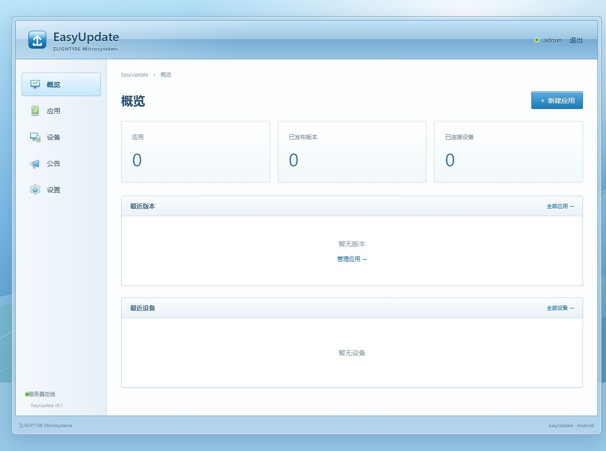

# EasyUpdate

**ZLIGHT106 Microsystems** · 自托管 APK / ZIP 更新服务器。

Go 标准库 HTTP、SQLite、服务端 HTML，无前端构建步骤。模板、样式和迁移内嵌在可执行文件中。

## 运行

仓库的 [dist/](dist/README.md) 包含 Windows、Linux x86-64 可执行文件和 Android Demo APK，可直接下载使用。

Linux x86-64：

```sh
cp config.example.yaml config.yaml
chmod +x dist/easyupdate-linux-amd64
./dist/easyupdate-linux-amd64
```

从源码构建：

```sh
cp config.example.yaml config.yaml
go build -o easyupdate .
./easyupdate
```

依赖 Go 1.26+；当前 SQLite 驱动要求 Go 1.26。使用纯 Go SQLite，无需 C 编译器。

Windows：

```powershell
Copy-Item config.example.yaml config.yaml
.\dist\easyupdate-windows-amd64.exe
```

Windows 从源码构建可运行 `go build -o easyupdate.exe .`。

打开 `http://127.0.0.1:8080`，默认账号 **admin**，密码 **admin**。

后台导航中的 **说明** 提供配置、版本发布、API、Android 接入、GitHub 导入及备份排错文档；也可登录后直接打开 [说明页](http://127.0.0.1:8080/admin/help)。

凭据保存在服务器的 `config.yaml`，修改 `admin.username`、`admin.password` 后重启即可。配置和运行数据不进入 Git；运行时仅保留 bcrypt 哈希。重启后需要重新登录。

`-config /path/config.yaml` 可指定配置文件。缺少配置时服务会退出，并提示复制示例文件；数据目录和数据库会自动创建。

## 功能

- 应用管理、APK / ZIP 上传确认、SHA256 和版本草稿。
- 发布、取消发布、强制更新标记、版本说明。
- 最新版本 API、流式下载和 HTTP Range。
- 可选 UUID 心跳、设备新增/编辑/删除与应用筛选。
- 公告管理和公开公告 API。
- GitHub 公开仓库的手动导入。

## 发布第一个版本

1. **应用 → 新建应用**，填写名称及 Android 包名。
2. **上传 APK**，确认包名、版本名称、整数版本号和 SHA256。
3. 填写版本说明，**创建草稿 → 发布版本**。

默认上传上限 512 MB，可修改 `storage.max_upload_mb`。服务器优先使用 PATH 中的 `apkanalyzer` 或 `aapt2`，随后尝试内置 Go 二进制 Manifest 解析器。不能解析的字段允许手动确认；已读取的字段不可覆盖，包名必须与应用一致。

APK 存放在 `data/apks/{app_id}/{version_code}/app.apk`。同一应用的版本号唯一；替换 APK 需要创建新版本。只有已发布版本可被公开查询和下载，最新版始终按 `version_code` 排序。

应用、版本和公告列表提供编辑与删除入口。删除应用需输入包名确认，同时删除其版本、APK、设备记录和 GitHub 来源；删除版本需输入版本号确认，并删除关联 APK。

设备支持新建、编辑、按应用筛选和删除。设备记录以应用和 UUID 唯一，删除需输入 UUID 确认；客户端再次发送心跳时会重新记录。

## API

```sh
curl 'http://127.0.0.1:8080/api/v1/apps/com.zlight106.easycent/latest?version_code=163'
curl -O 'http://127.0.0.1:8080/api/v1/apps/com.zlight106.easycent/releases/164/download'
curl 'http://127.0.0.1:8080/api/v1/announcements'
```

有更新时：

```json
{
  "package_name": "com.zlight106.easycent",
  "update_available": true,
  "version_name": "1.6.4",
  "version_code": 164,
  "mandatory": false,
  "published_at": "2026-10-04T06:00:00Z",
  "release_notes": "Fix bugs",
  "download_url": "http://127.0.0.1:8080/api/v1/apps/com.zlight106.easycent/releases/164/download",
  "size": 18439210,
  "sha256": "64 hexadecimal characters"
}
```

客户端版本大于或等于最新版本时返回 `update_available: false`、`latest_version_name` 和 `latest_version_code`。未提供版本号等同于版本号 0。

心跳无需认证，正文上限 4 KB，只记录随机 UUID、应用和版本：

```sh
curl -X POST 'http://127.0.0.1:8080/api/v1/heartbeat' \
  -H 'Content-Type: application/json' \
  -d '{"device_id":"a94187b3-cc2f-4ef0-93fb-04e7e3444342","package_name":"com.zlight106.easycent","version_name":"1.6.3","version_code":163}'
```

成功返回 `{"ok":true}`。公开错误返回 JSON `error` 和 `message`；不存在的应用或已发布版本返回 404。

## Windows / ZIP 更新包

后台“上传更新包”支持 `.apk` 和 `.zip`；应用标识继续使用点分名称，例如 `com.zlight.t50labelprinter`。APK 的解析、存储与下载流程保持兼容，原数据库结构无需迁移。ZIP 存放在 `data/apks/{app_id}/{version_code}/app.zip`；版本列表和下载按钮显示实际类型。

ZIP 根目录可包含 `easyupdate.json`，自动读取并锁定版本信息：

```json
{"package_name":"com.zlight.t50labelprinter","version_name":"1.7.0","version_code":10700}
```

元数据最多 4 KB；版本号为 1–2147483647 的整数。未附带元数据时，可在上传确认页手动填写应用与版本。服务会检查 ZIP 目录、重复名称、路径和展开大小，存储原始 ZIP，不在服务器上解压。

公开 `latest` API 新增 `artifact_type`（`apk` / `zip`）与 `file_name`，其余字段及版本比较规则保持不变。ZIP 下载返回 `application/zip`，支持 Range、SHA256 ETag。客户端应验证大小与 SHA256；Windows 客户端可进一步核对 ZIP 内的版本信息，然后由用户解压运行。

GitHub 来源匹配规则可填写 `*.zip` 或 `T50LabelPrinter-v*.zip`；同步读取 ZIP 的 easyupdate.json，确认创建草稿后发布。仅导入已发布的公开 GitHub Release，仍不自动发布。
## Android Demo

使用 Android Studio 打开 `android-demo/`，或使用 JDK 17、Android SDK 35：

```sh
cd android-demo
./gradlew assembleDebug
./gradlew assembleDebug -PdemoVersionCode=2 -PdemoVersionName=1.1.0
```

Windows 使用 `gradlew.bat`。SDK 路径通过 `ANDROID_HOME` 或本地 `local.properties` 配置。

Demo 包名：`com.zlight106.easyupdate.demo`。支持 Android 4.4 / API 19，默认版本 `1.0.0 / 1`，普通 Activity + XML，无 Compose。仅额外使用 AndroidX Core 的 FileProvider。

首次升级测试建议以 `dist/android/easyupdate-demo-v1.apk`（`1.0.0 / 1`）为起点；将同一签名的 `dist/android/easyupdate-demo-v2.apk`（`1.1.0 / 2`）上传到服务器并发布。若设备已安装更高版本，保留应用数据和 UUID，改用更高 `versionCode` 构建后续升级，不要卸载或降级。当前测试服务器为 `http://192.168.95.55:19910`，服务端 `server.public_url` 和 Demo 的 Server URL 均使用此地址，不带 `/admin`。依次执行 **Check Update → Download Update → Verification Passed → Install**。模拟器默认地址仍为 `http://10.0.2.2:8080`。

Demo 首次启动生成 UUID 并保存到 SharedPreferences，启动和检查更新后异步发送心跳。下载流式写入缓存，校验大小、SHA256、包名和版本后才提供安装按钮。安装使用 FileProvider 和系统安装器；Android 8+ 按提示打开未知来源安装设置。强制更新仅隐藏 Later。

为局域网调试启用了 HTTP。Android 4.4 的 TLS 较旧，现代 HTTPS 服务可能不兼容；客户端保持系统证书验证，不降低服务器 TLS 安全性。同包名升级要求 APK 使用相同签名。

可选仪表测试，在 `android-demo/` 目录执行。构建目录的 `app-debug.apk` 可能已是 v2，首次测试建议使用 `dist` 中的 v1；以下安装命令仅适用于尚未安装更高版本的设备。安装后，在 Demo 保存上述服务器地址；Android 8+需允许 Demo 安装未知来源应用，再运行仪表命令：

```sh
./gradlew assembleDebugAndroidTest
adb install -r ../dist/android/easyupdate-demo-v1.apk
adb install -r app/build/outputs/apk/androidTest/debug/app-debug-androidTest.apk
adb shell am instrument -w -e server http://192.168.95.55:19910 com.zlight106.easyupdate.demo.test/com.zlight106.easyupdate.demo.SmokeInstrumentation
```

出现 `PASS Check / Download / SHA256 / FileProvider installer intent` 且 `INSTRUMENTATION_CODE: -1` 表示仪表通过；`FAIL` 或结果码 `0` 表示失败。仪表仅验证到发起安装，不验证实际升级和心跳。仍需在系统安装器确认安装、重新打开 Demo，确认已升级到发布的目标版本（首次测试为 `1.1.0 / 2`），后台同一 UUID 的版本号与之相同且最近上报时间增加；再次检查应显示 `Up to date`。

## GitHub 同步

在应用详情中填写 Owner、Repository、APK 匹配规则并启用，保存后点击 **同步 GitHub**。

每次从最近 100 个公开 Release 中导入一个尚未入库的 APK；跳过 GitHub 草稿。匹配多个 APK 时需缩小规则，例如 `*-arm64.apk`。版本以 APK 元数据为准，Tag 仅记录来源；不一致时显示提示。导入进入确认页，创建后的版本仍是草稿，需要手动发布。

`github.token` 可选，只有 GitHub API 请求携带 Token。Token 不显示在页面或日志中；有 Token 也不导入私有仓库。

## Docker

```sh
cp config.example.yaml config.yaml
mkdir -p data
docker build -t easyupdate .
docker run --name easyupdate -p 8080:8080 \
  -v "$PWD/data:/app/data" \
  -v "$PWD/config.yaml:/app/config.yaml:ro" \
  easyupdate
```

部署时将 `server.public_url` 改为客户端可以访问的实际地址。HTTPS 地址会启用 Secure Cookie。可将服务放在已有 HTTPS 反向代理后；代理需允许对应 APK 上传大小和下载超时。

## 验证

```sh
go build ./...
go test ./...
go vet ./...
python scripts/smoke.py ./easyupdate --api --extras --crud
```

HTTP 验证会使用临时数据库与真实 APK，覆盖登录、上传确认、发布、最新版本、SHA256、Range、取消发布、心跳 upsert 和公告；结束后删除测试数据。

测试 APK 来自 [AndroidBinary](https://github.com/shogo82148/androidbinary)，许可保留在 `internal/storage/testdata/LICENSE.androidbinary`。

本机验证结果及环境限制见 [docs/verification.md](docs/verification.md)。

## 目录

```text
main.go                    启动、资源内嵌
internal/config/           YAML 配置
internal/database/         SQLite、迁移、查询
internal/storage/          APK 保存、校验、元数据
internal/github/           GitHub 客户端
internal/server/           管理页面、会话、API
templates/ · static/       HTML、CSS、少量 JavaScript
android-demo/              独立 Android Studio 项目
scripts/smoke.py            临时 HTTP 验证
```

## 备份

停止服务，复制 `data/` 和 `config.yaml`。恢复这两个路径后启动即可。

## 界面

使用本地 [7.css](https://khang-nd.github.io/7.css/) 0.21.1 的 Aero 窗口、按钮、表单、折叠区和状态栏；无需 CDN 或前端构建。原版样式、MIT 许可证和来源记录保存在 [static/vendor/7css/](static/vendor/7css/README.md)。

蓝色 Aero 玻璃边框与浅色实体内容区。参考 [Frutiger Aero Archive](https://frutigeraeroarchive.org/) 与 [zlight106.top](https://zlight106.top/)，背景与导航图标为项目自己的 SVG。



[登录页截图](docs/screenshots/login.png)
